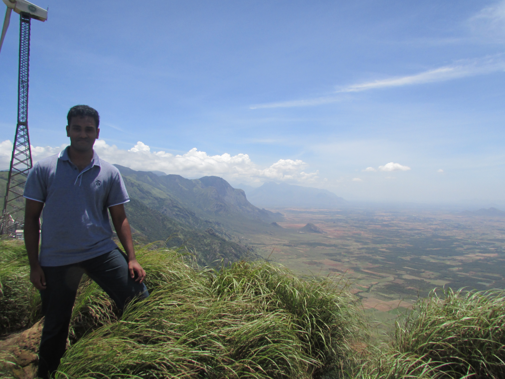

### Hello! 👋

  

I am an undergraduate Computer Science student and software engineer, currently studying at the University of Plymouth.

This is where I put most of my coding related work and anything interesting I decide to build.

### What am I doing right now?

- 🔭 I’m currently working on [Visualising Optimisation Data](https://github.com/GoelBiju/Visualising-Optimisation-Data)

- 👯 I’m looking to collaborate on [MJSSA Digital Library](https://github.com/MJSSA/digital-library-mobile)

<!--
**GoelBiju/goelbiju** is a ✨ _special_ ✨ repository because its `README.md` (this file) appears on your GitHub profile.

Here are some ideas to get you started:

- 🔭 I’m currently working on ...
- 🌱 I’m currently learning ...
- 👯 I’m looking to collaborate on ...
- 🤔 I’m looking for help with ...
- 💬 Ask me about ...
- 📫 How to reach me: ...
- 😄 Pronouns: ...
- ⚡ Fun fact: ...
-->
